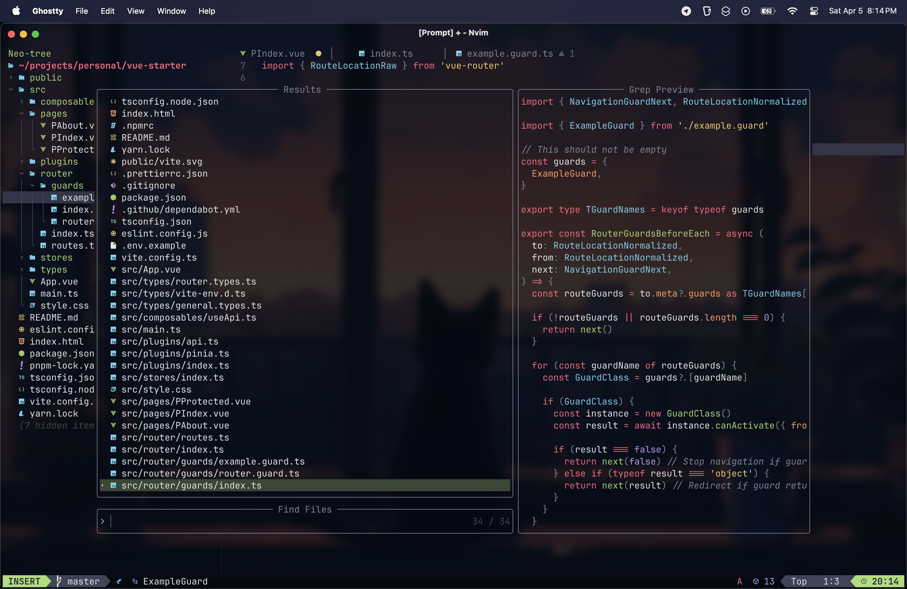

# My Neovim config with 💤 LazyVim

Setup for:

- JavaScript/TypeScript
- Vue/Nuxt
- Tailwindcss
- Nodejs

Visit [LazyVim](https://github.com/LazyVim/LazyVim) for more info.
Refer to the [documentation](https://lazyvim.github.io/installation).

## Showcase

